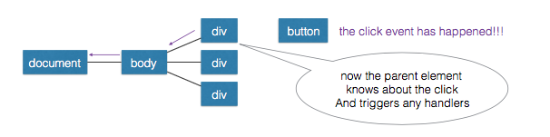
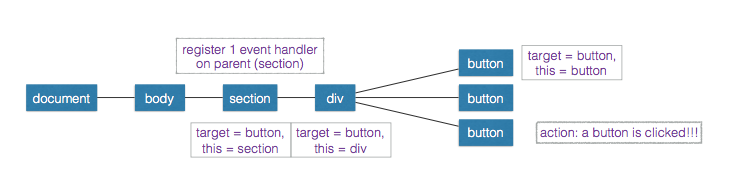

# Game of Life in JS

## Game of Life

 “Zero-player” game (see animation)
 Rooted in Von Neumann’s quest for artificial/simulated life  Created by Jon Conway in 1970
 Sparked niche field: cellular automaton
 Simple rules can produce complex behavior
 
 

## RULES

 2D grid of cells that are currently on or off (dead or alive)
 Each step, grid updates all-at-once
 Currently alive cell
 “Underpopulation”: dies given fewer than 2 live neighbors
 “Overcrowding”: dies given greater than 3 live neighbors
 Otherwise, lives on
 Currently dead cell
 “Birth”: comes to life given exactly 3 live neighbors
 Otherwise, remains dead
 
 

## MANIPULATING THE DOM

 Changing Attributes for Style
 Making Elements
 Putting them into the DOM
 Remove Elements
 
 

## CHANGING STYLE ATTRIBUTES

<code>element.style.backgroundColor = “blue”</code>
CSS -> JavaScript
background-color -> backgroundColor
border-radius -> borderRadius
font-size -> fontSize
list-style-type -> listStyleType
word-spacing -> wordSpacing
z-index -> zIndex
 
 

## CHANGING CSS CLASSES

 **classList** is HTML5 way to modify which classes are on an
<code>document.getElementById("MyElement").classList.add('class')</code>
<code>document.getElementById("MyElement").classList.remove('class')</code>
<code>if ( document.getElementById("MyElement").classList.contains('class') )</code>
<code>document.getElementById("MyElement").classList.toggle('class')</code>
 
 

## EVENT HANDLERS

<code>element.addEventListener(‘click’, function(event) { // Run this code on click
})</code>
 JS that handles things that happen in the DOM
 Event examples:
 • click
 • (form) submit
 • hover
 • mouseover
 
 

## EVENT PROPAGATION/BUBBLING

 An event is directed to its intended target
 If there is an event handler it is triggered
 From here, the event **bubbles** up to the containing elements
 This continues to the document element itself

 
 

## EVENT DELEGATION

 The process of using event propagation to handle events at a higher level in the DOM
 Allows for a single event listener

 
